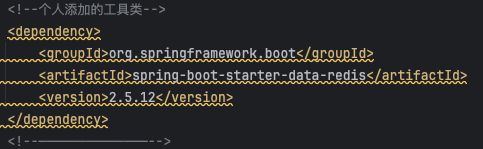
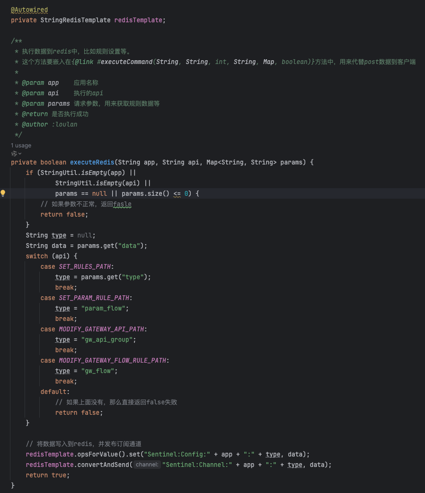
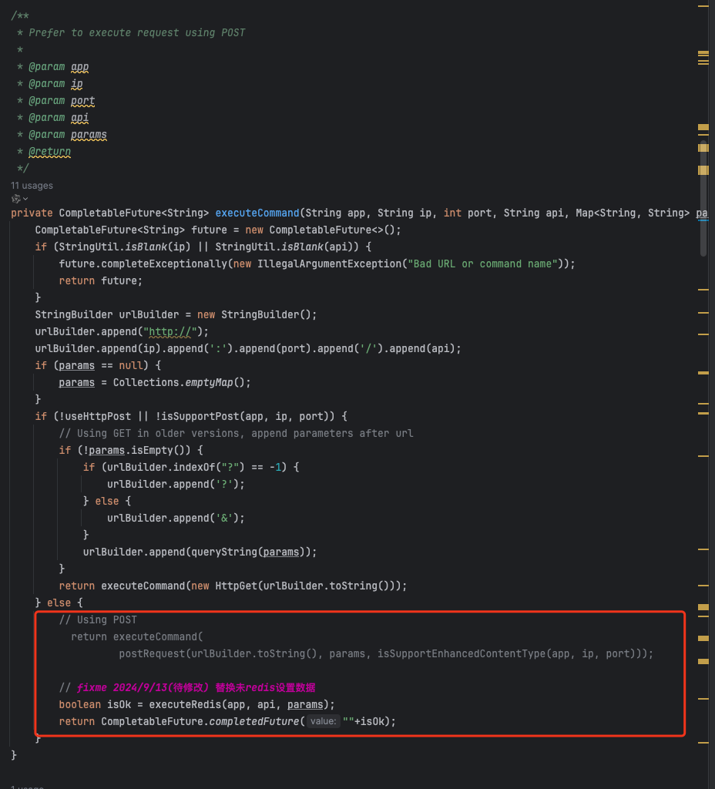

# 构建说明

### 一、概述

&emsp;&emsp;sentinel-dashboard 控制台和客户端的通信是通过 Http请求来进行的，所有的规则数据是保存在内存中的，所以只要项目重启就回丢失规则，官网给出了，nacos、file等的持久化，还有 redis、file 等持久化方式，本docker构建的就是redis持久化方式的。

&emsp;&emsp;具体如何使用可以查看该项目的 docker 详情文档。这里只对如果构建修改做一些描述。

### 二、改动说明

&emsp;&emsp;在控制台中，所有的请求都是通过 `com.alibaba.csp.sentinel.dashboard.client.SentinelApiClient` 来进行的，所以改动也是针对这个类进行。获取数据依旧是通过 HTTP 请求去客户端获取。**但是设置数据是通过 redis 的发布订阅通道来进行的**，所以这里的改动也就是将 HTTP 的 post 设置数据改为 redis 发布订阅数据。

### 三、改动详情

#### 1. 引入`spring-boot-starter-data-redis`的包

版本号对应项目中的 spring-boot。

#### 2. 添加方法

需要在 `com.alibaba.csp.sentinel.dashboard.client.SentinelApiClient` 中添加 redis 的发布订阅方法，同时要将数据写入到redis中。

#### 3. 替换 post 数据推送部分代码

第二步的方法既能将数据保存到 redis 中，同时也能将数据推送到客户端，所以这里使用这个方法来替换原来的 数据推送代码。

# 构建命令

> **docker build -t osmiling/sentinel-dashboard:1.8.5-redis .**